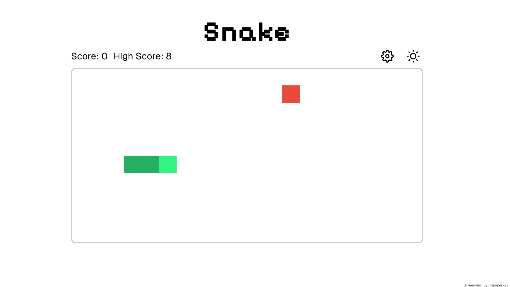

# Snake Game

This repository contains the code for a modern version of the classic Snake game, implemented using Next.js and React. The game features responsive controls, multiple difficulty settings, and a sleek, modern UI with dark and light mode toggle.

[View production app](https://snake-mu-black.vercel.app/)

## Features

- **Responsive Game Controls**: Use arrow keys for navigation in desktop view and swipe gestures in mobile view.
- **Difficulty Levels**: Players can choose between Easy, Medium, and Hard difficulty settings, which affect the speed of the snake.
- **Score Tracking**: The game tracks the player's current score and high score.
- **Theme Toggling**: Users can switch between a light and a dark theme for better visibility based on ambient lighting.
- **Animation Effects**: Utilizes Framer Motion for smooth and visually appealing transitions and Confetti for reaching a new high score.

## Technology Stack

- **Next.js**: The React framework for production.
- **React**: A JavaScript library for building user interfaces.
- **Framer Motion**: A powerful animation library for React.
- **CSS Modules**: For styling components in a modular and reusable way.
